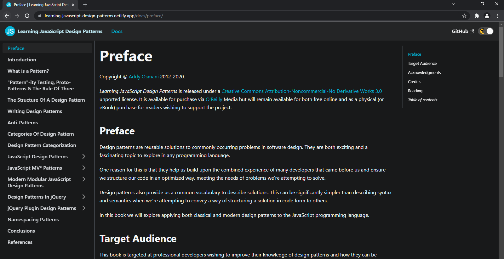

# Learning JavaScript Design Patterns

_A book by Addy Osmani_

## Preview

## Why I made this?

I find it quite uncomfortable to read the book with light mode - it just doesn't fit my eyes. So, I take the content of the book and make a static site with dark mode support. If you're here to learn Javascript, feel free to use it on your own.

## Link

https://learning-javascript-design-patterns.netlify.app

## Original Source

The content of this book belongs to [Addy Osmani](https://twitter.com/addyosmani).

https://addyosmani.com/resources/essentialjsdesignpatterns/book/

or https://www.patterns.dev/posts/classic-design-patterns/

### Update

The original source has a brand new UI look, which is so much better than it was, but still doesn't support dark mode.
